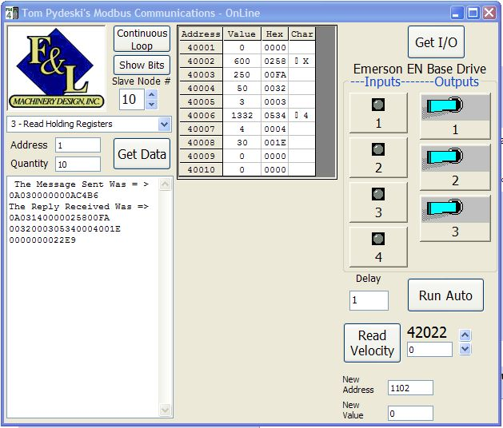



## ModBus Communications Protocol

### Description

This one is mostly for Controls Engineers.

Emerson Control Techniques manufactures Servo drives that communicate via the ModBus Protocol.

This was and old GWBasic version of the protocol that I think I got from Taylor Software 10 years ago.

I have adapted it for VB 6.0 (Win XP is my OS) using flexgrid to display the register contents. I also set this demo up to poll the physical I/O and velocity of an Emerson EN-208 Base drive. It can be adapted to communicate with any serial device that uses the ModBus Protocol.
 
### More Info
 
Enter the Node address; starting address; and quantity of registers to be read.

Don't try to run this program unless you are connected to a valid ModBus device.

The contents of the queried registers/inputs/outputs.

I did not do a lot of commenting on this, so be warned that you may not understand some sections...

Also, I am running on WinXP, so the beep function will not work on Non-NT OS's.

             |
---                |---
**Submitted On**   |2004-07-14 09:31:24
**By**             |[Tom Pydeski](https://github.com/Planet-Source-Code/PSCIndex/blob/master/ByAuthor/tom-pydeski.md)
**Level**          |Advanced
**User Rating**    |5.0 (35 globes from 7 users)
**Compatibility**  |VB 6\.0
**Category**       |[Complete Applications](https://github.com/Planet-Source-Code/PSCIndex/blob/master/ByCategory/complete-applications__1-27.md)
**World**          |[Visual Basic](https://github.com/Planet-Source-Code/PSCIndex/blob/master/ByWorld/visual-basic.md)
**Archive File**   |[ModBus\_Com1769717142004\.zip](https://github.com/Planet-Source-Code/tom-pydeski-modbus-communications-protocol__1-54944/archive/master.zip)

### API Declarations

NTBeep and SendMessageBynum

